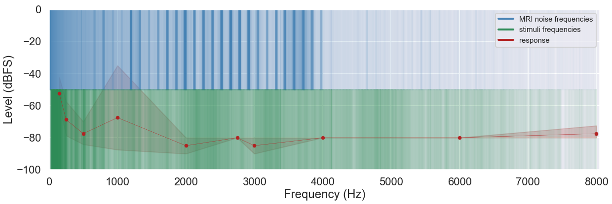
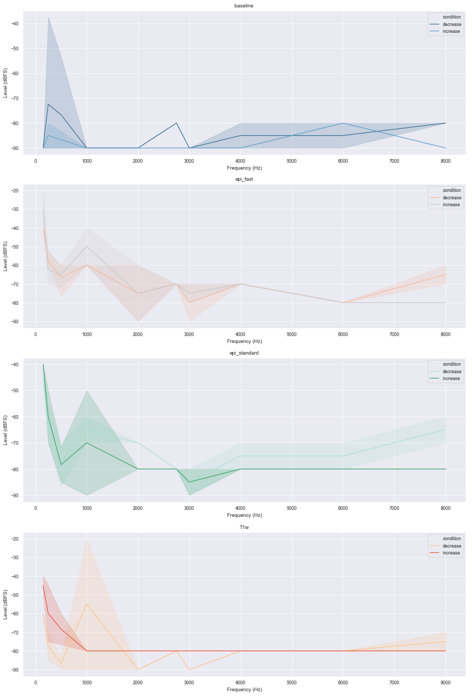

# Ain't no sound loud enough? - audiometry in MRI settings

## Description
ANSL is a toolbox (and hopefully soon BIDS app) for conducting audiometry like measurements in MRI settings. In more detail, it includes adjustable [short experiments](https://github.com/C0C0AN/audiometry_mri/scripts_stimulation) targeting hearing thresholds by presenting a range of frequencies in ascending and descending loudness, the automated analysis of [recorded responses](https://github.com/C0C0AN/audiometry_mri/scripts_analyses), [tutorials regarding stimuli](https://github.com/C0C0AN/audiometry_mri/scripts_stimulation) and plotting functionalities, e.g. plotting hearing thresholds on top of scanner and stimuli frequencies to visualize possible interaction effects (graphic above) and plotting loudness increase and decrease trials in different scanner settings (graphic below).        

## Documentation
A documentation is currently in the works and will be available soon. Sorry for any inconvenience this might cause.   

## How to report errors
Running into any bugs :beetle:? Check out the [open issues](https://github.com/C0C0AN/audiometry_mri/issues) to see if we're already working on it. If not, open up a new issue and we will check it out when we can!

## How to contribute
Thank you for considering contributing to our project! Before getting involved, please review our [Code of Conduct](https://github.com/C0C0AN/audiometry_mri/blob/master/CODE_OF_CONDUCT.md). Next, you can review  [open issues](https://github.com/C0C0AN/audiometry_mri/issues) that we are looking for help with. If you submit a new pull request please be as detailed as possible in your comments. Please also have a look at our [contribution guidelines](https://github.com/C0C0AN/audiometry_mri/blob/master/CONTRIBUTING.md).

### Acknowledgements
If you intend to or already used ANSL, we would be very happy if you cite this github repo, till we have "something" out there!

Please feel free to contact me wrt any question or idea via mail (herholz dot peer at gmail dot com), twitter ([@peerherholz](https://twitter.com/peerherholz?lang=eng)) or the brainhack slack team (@peerherholz). 
