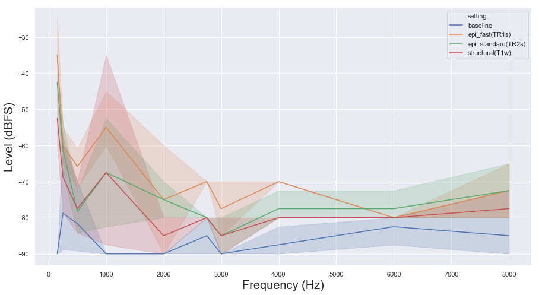
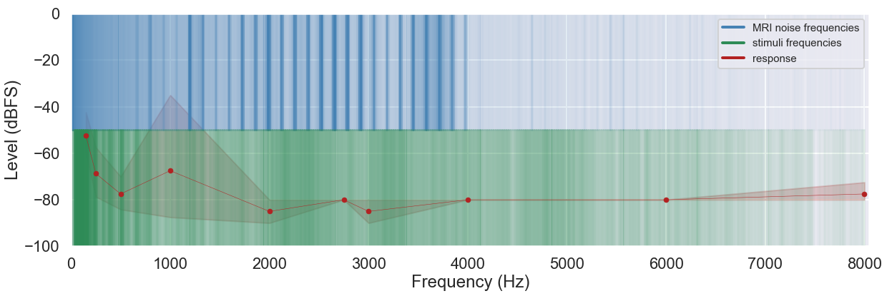

Ain't no sound loud enough - audiometry-like measurements for the assessment of acoustic MRI noise
==================================================================================================

.. image:: https://img.shields.io/github/issues-pr/C0C0AN/audiometry_mri.svg
    :alt: PRs
    :target: https://github.com/C0C0AN/audiometry_mri/pulls/

.. image:: https://img.shields.io/github/contributors/C0C0AN/audiometry_mri.svg
    :alt: Contributors
    :target: https://GitHub.com/C0C0AN/audiometry_mri/graphs/contributors/

.. image:: https://github-basic-badges.herokuapp.com/commits/C0C0AN/audiometry_mri.svg
    :alt: Commits
    :target: https://github.com/C0C0AN/audiometry_mri/commits/master

.. image:: http://hits.dwyl.io/C0C0AN/audiometry_mri.svg
    :alt: Hits
    :target: http://hits.dwyl.io/C0C0AN/audiometry_mri

.. image:: https://img.shields.io/badge/License-BSD%203--Clause-blue.svg
    :alt: License
    :target: https://opensource.org/licenses/BSD-3-Clause
    
.. image:: https://img.shields.io/badge/Supported%20by-%20CONP%2FPCNO-red
    :alt: support_conp
    :target: https://conp.ca/

Description
===========
ANSL is a toolbox (and hopefully soon BIDS app) for conducting audiometry like measurements in MRI settings. In more detail, it includes adjustable `short experiments <https://github.com/C0C0AN/audiometry_mri/scripts_stimulation>`_ targeting hearing thresholds by presenting a range of frequencies in ascending and descending loudness, the automated analysis of `recorded responses <https://github.com/C0C0AN/audiometry_mri/scripts_analyses>`_, `tutorials regarding stimuli <https://github.com/C0C0AN/audiometry_mri/scripts_stimulation>`_ and plotting functionalities, e.g. plotting hearing thresholds on top of scanner and stimuli frequencies to visualize possible interaction effects (graphic above), plotting mean hearing thresholds across different scanner settings (graphic below) and plotting loudness increase and decrease trials in different scanner settings (graphic further down).

Overview of functionality
=========================
As mentioned above, ANSL is divided into three sections that include respective functions:

Audiometry measurements
_________

Visualization
______________

Utilities
________

Documentation
=============

A documentation is currently in the works and will be available soon. Sorry for any inconvenience this might cause.

How to report errors
____________________
Running into any bugs :beetle:? Check out the `open issues <https://github.com/CoCoAN/audiometry_mri/issues>`_ to see if we're already working on it. If not, open up a new issue and we will check it out when we can!

How to contribute
_________________
Thank you for considering contributing to our project! Before getting involved, please review our `Code of Conduct <https://github.com/CoCoAN/audiometry_mri/blob/master/CODE_OF_CONDUCT.rst>`_. Next, you can review `open issues <https://github.com/CoCoAN/audiometry_mri/issues>`_ that we are looking for help with. If you submit a new pull request please be as detailed as possible in your comments. Please also have a look at our `contribution guidelines <https://github.com/CoCoAN/audiometry_mri/blob/master/CONTRIBUTING.rst>`_.

Acknowledgements
================
If you intend to or already used ANSL, we would be very happy if you cite this github repo, till we have "something" out there!

Please feel free to contact me wrt any question or idea via mail (herholz dot peer at gmail dot com), twitter (`@peeherholz <https://twitter.com/PeerHerholz?lang=eng>`_) or the brainhack slack/mattermost team (@peerherholz).

Support
=======
This work is supported in part by funding provided by `Brain Canada <https://braincanada.ca/>`_, in partnership with `Health Canada <https://www.canada.ca/en/health-canada.html>`_, for the `Canadian Open Neuroscience Platform initiative <https://conp.ca/>`_.

.. image:: https://conp.ca/wp-content/uploads/elementor/thumbs/logo-2-o5e91uhlc138896v1b03o2dg8nwvxyv3pssdrkjv5a.png
    :alt: logo_conp
    :target: https://conp.ca/
